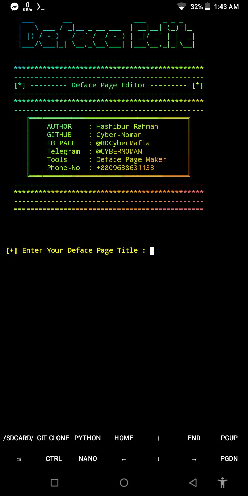

# Deface-Editor
# What's This 🤔

[•] Create Own Deface Page 📄📃

# How to Use 🤔

[•] Use This Command:
```
pkg update -y 
pkg upgrade -y
pkg i git -y
pkg i python -y
pkg i ruby -y
gem install lolcat
rm -rf Deface-Editor
cd $HOME
git clone https://github.com/Cyber-Noman/Deface-Editor
cd Deface-Editor
python Deface-Editor.py
```
# Demo / ScreenShort --



# Tutorial -
[•] Coming

# Open Source -
[•] Nothing/ Never/ Kabhi Neyi
